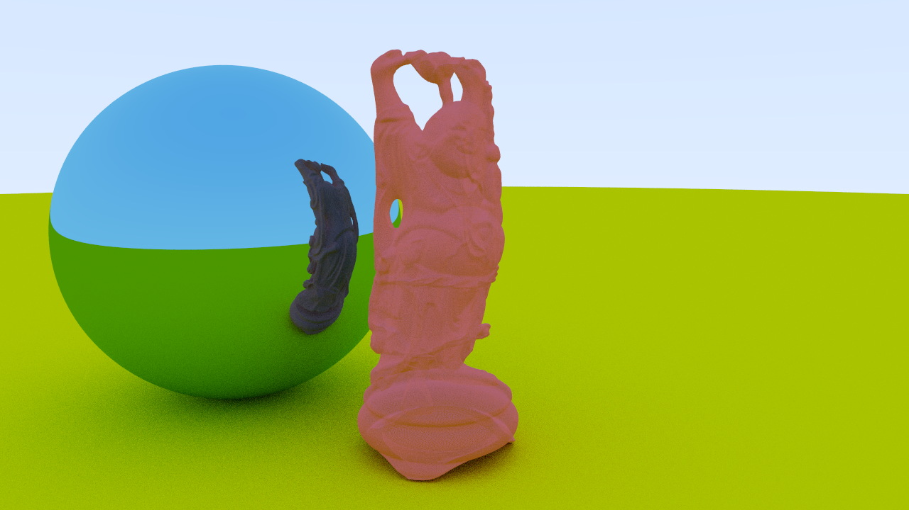

Raytracer using BVH
-------------------------------------

  Relatively simple and efficient raytracer using bounding volume hierarchy with
  surface are heuristic. The program takes a model as an input and produces a .tga
  file as an output.

Input
-----

  The program takes PLY files as input (https://en.wikipedia.org/wiki/PLY_(file_format)).
  Example files can be found from the Stanford 3D Scanning Repository (http://graphics.stanford.edu/data/3Dscanrep/).

Output
------

  Program creates TGA files from the given 3d-model (https://en.wikipedia.org/wiki/Truevision_TGA).
  Output images will be placed in the images folder, that will be created if one
  doesn't exist.

Usage
-----

  Source files can be compiled using GCC with the given makefile or with Visual Studio,
  but you might have to change some project settings. Running the program with no
  arguments outputs a scene with some spheres and running the program with a path
  to the model creates an image about given model.

Example
-------

  - Open terminal.
  - Run command: `make`.
  - Run command: `./rt models/happy_vrip.ply`.
  - Wait about one minute for the program to run.
  - Image of the buddha model is created.

  Image sample_render.tga was created using resolution 1920x1080 with 50x antialiasing
  for highest resolution of happy buddha model. Creating BVH of the image took 19
  seconds and rendering the image took 37 seconds with a combined total time of 56
  seconds (Intel Core i7 6700HQ @ 2.60 ghz).

